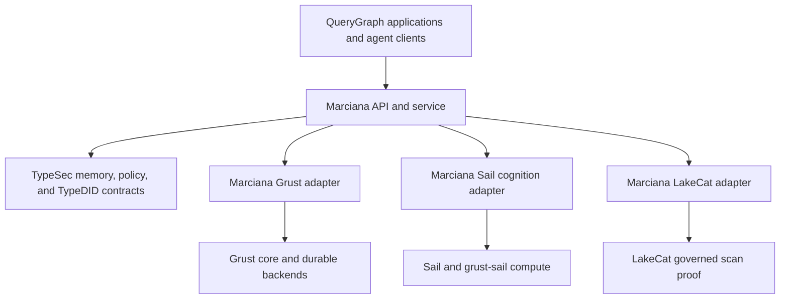

# Marciana as a QueryGraph Stack Project

**Status:** accepted project boundary; extraction in progress

**Decision date:** 2026-08-05

**Target checkout:** `~/src/marciana`

**Target upstream:** a first-class sibling project in the QueryGraph stack

The local checkout is initialized. The history-preserving transplant is now
complete in `~/src/marciana` as merge commit `3fee1f9`, with the workspace
configuration and local verification committed as `4950a58`. qg-rust now
resolves the standalone crate in local commit `f25863b`. Marciana now has the
public upstream `https://github.com/querygraph/marciana` with the preserved
history on `main`; reachable Grust, TypeSec, LakeCat, and Sail dependency pins
and the clean-clone gate remain outstanding.

## Document role

This document records the architectural decision establishing Marciana as a
standalone QueryGraph-stack project. It defines the repository charter,
ownership boundaries, dependency direction, extraction inventory, migration
sequence, and acceptance criteria.

It does not replace the existing Marciana security design:

- [`MEMORY.md`](MEMORY.md) remains authoritative for Marciana's security
  invariants, TypeSec vault boundary, realized v1 architecture, and the rule
  that only the vault may rehydrate or mutate protected memory.
- [`MARCIANA.md`](MARCIANA.md) is the dated Cognee Rust and Akka/Fluree
  comparative review and delivery record that motivated the program.
- This file is the TypeSec-side extraction handoff. The initialized
  `~/src/marciana` repository owns the active product design, roadmap,
  compatibility matrix, and integration release process; this file must not
  become a competing roadmap.

## Decision

The initialized `~/src/marciana` checkout is the reusable AI memory and
cognition layer in the QueryGraph stack.

Marciana is a product and composition layer, not a fifth storage or security
substrate. It owns the public memory lifecycle, cognition
orchestration, durable jobs, memory-specific adapters, and native four-verb API
behavior while depending on the existing projects for their authoritative
capabilities:

- TypeSec remains the trust and information-flow kernel.
- Grust remains the graph, query, transaction, and durable commit substrate.
- Sail remains the reusable distributed compute engine.
- LakeCat remains the catalog and governed-scan proof authority.
- QueryGraph applications remain product consumers and integration targets.

The load-bearing rule remains unchanged:

> Cognition proposes, indexes rank, stores persist, TypeDID identifies, and
> only the capability-gated TypeSec vault reveals or mutates memory.

The extraction is therefore an upward move of Marciana-specific orchestration
and adapters. It must not move authorization down into cognition, make a store
an authority, or create a second path around `MemoryVault`.

## Why a separate project now

The implementation has crossed the threshold at which a standalone project
improves cohesion and dependency direction:

1. Grust's private `querygraph-memory` crate already describes itself as
   Marciana's Grust adapter. It depends upward on the sibling
   `typesec-memory` crate while also consuming Grust and optional Sail
   backends. It is deliberately unpublished pending a distribution decision.
2. The crate contains product-domain behavior—memory graph projection,
   privacy-aware vector ranking, deduplication, contradiction analysis,
   cognition requests, LakeCat-shaped source evidence, and memory-specific
   Sail execution—not generic graph mechanics.
3. qg-rust currently acts as the composition root. Its Marciana code opens the
   store, installs a TypeSec vault and tool guard, translates a LakeCat proof,
   checks verified TypeDID subject and purpose, and invokes cognition. That is
   reusable memory-service assembly rather than QueryGraph Navigator logic.
4. The remaining production program is cohesive in its own right: durable job
   state, leases, cancellation, bounded retry, proposal application,
   transactional mutation and index outbox delivery, receipt recovery,
   assertion lifecycle, API compatibility, and service-level failure tests.
5. Marciana needs an independent compatibility and release line. Inheriting
   Grust's workspace version or qg-rust's application release cadence obscures
   whether a given memory API, proposal schema, and backend combination are
   compatible.

This is a refinement of the existing placement decision in `MEMORY.md`, which
already assigns Marciana's security core to TypeSec and its scale/cognition
tier to the QueryGraph stack. It is not a reversal of that design.

## Project charter

Marciana owns:

- the native `remember`, `recall`, `improve`, and `forget` lifecycle;
- dataset, memory-space, and session behavior above the TypeSec resource
  model;
- versioned public request, response, status, error, event, and receipt DTOs;
- ingestion, chunking, extraction, temporal enrichment, entity resolution,
  summarization, communities, deduplication, reconciliation, feedback, and
  hybrid retrieval orchestration;
- durable cognition jobs, leases, cancellation, bounded retry, progress,
  idempotency, recovery, and observability;
- production implementations of TypeSec's storage, semantic-index,
  index-outbox, cognition-authority, and cognition-commit contracts;
- memory-specific Grust graph projection and schema migrations;
- memory-specific Sail input/output schemas and cognition executors;
- the adapter from LakeCat's governed scan proof into a TypeSec-bound cognition
  request;
- assertion provenance, authored and derived layers, corroboration,
  disagreement, conflict, negation, retraction, and resurrection semantics;
- an embeddable Rust router and, when operationally justified, a standalone
  service;
- language clients and cross-language wire fixtures; and
- cross-stack compatibility, security, recovery, and running-service tests.

Marciana does not own:

- capability issuance, policy evaluation, label lattices, clearance,
  quarantine, retention enforcement, or private content rehydration;
- TypeDID cryptography, request verification, replay primitives, or generic
  receipt signing;
- generic graph types, GQL/Cypher, backend-independent traversal, or database
  transaction mechanics;
- generic Arrow staging, Spark Connect execution, or lakehouse computation;
- Iceberg catalog state, scan planning, or authorization-proof issuance;
- QueryGraph's semantic-model registry, Navigator, governed-answer, or QGLake
  product behavior; or
- a Cognee runtime or Cognee storage-adapter dependency.

## Ownership after extraction

| Concern | Authoritative owner | Marciana's relationship |
|---|---|---|
| Capabilities, policy, labels, quarantine, retention, private rehydration | TypeSec | Calls and implements TypeSec contracts; never bypasses the vault |
| Cognition proposal validation, source-manifest digest, label recomputation, guarded application | TypeSec | Produces inert proposals and requests vault application |
| TypeDID verification and generic signed receipts | TypeSec | Consumes verified context and requests domain receipts |
| Graph model, traversal, GQL/Cypher, generic mutation and guarded commit | Grust | Projects Marciana records and implements memory-specific adapters |
| Turso/libSQL and other graph backends | Grust | Uses backend capabilities without owning their transaction engines |
| Distributed Arrow/Spark execution | Sail and `grust-sail` | Supplies memory-specific schemas, SQL, and proposal-producing jobs |
| Iceberg catalog and governed scan proof | LakeCat | Consumes `GovernedScanProof` through an optional adapter |
| Four-verb API, jobs, cognition, memory ledger schema, compatibility | Marciana | Owns and versions the product behavior |
| Navigator, QGLake, semantic models, governed answers | QueryGraph | Embeds or calls Marciana as a consumer |

## Required dependency direction



The following reverse dependencies are forbidden:

```text
TypeSec -X-> Marciana
Grust   -X-> Marciana
Sail    -X-> Marciana
LakeCat -X-> Marciana
```

Foundational repositories may add domain-neutral capabilities needed by
Marciana, but they must not import Marciana types or implement Marciana product
policy. Marciana consumes those capabilities through adapters.

The native Marciana API must not require LakeCat. Direct text, file, URL, and
session memory remain valid inputs. LakeCat is one governed source adapter,
selected when cognition operates over authorized Iceberg snapshots.

## Four-verb API boundary

Cognee is design inspiration, not an API compatibility target, product
dependency, or completeness criterion. The native four-verb contract is
authoritative. A Cognee-shaped edge adapter is outside the baseline and would
require a separate future decision; it could only lower into the native
contract without importing Cognee runtime or storage behavior.

| Verb | Marciana behavior | Security and durability rule |
|---|---|---|
| `remember` | Normalize and ingest source material, create memory records, and optionally schedule cognition | Every durable write enters through a capability-gated vault operation; asynchronous enrichment receives no direct mutation handle |
| `recall` | Route among lexical, vector, entity, fact, graph, temporal, and completion strategies | Retrieval engines return candidates or ranked IDs; only the vault rehydrates content and applies space, purpose, validity, quarantine, and clearance gates |
| `improve` | Run extraction or enrichment over an authorized immutable snapshot and produce a versioned proposal | The job emits inert `CognitionProposal` data; the vault reauthorizes, recomputes source and label evidence, and applies one guarded transaction |
| `forget` | Remove or retract scoped session, item, or dataset memory and its derived retrieval artifacts | Deletion is tenant- and space-scoped, capability-gated, audited, transactionally paired with outbox work, and receipt-producing; no production `forgetAll` path exists |

Lower-level operations such as explicit dataset management may be exposed as
native adapters. They must lower into the same four lifecycle semantics and
may not create an alternate authority path.

## Ledger and persistence boundary

Marciana owns the logical memory ledger: record and assertion schemas, durable
job state, proposal identities and digests, idempotency namespaces,
index-outbox entries, audit evidence, receipt recovery metadata, and schema
migrations. Protected proposals remain transient unless a future, explicitly
designed encrypted-persistence contract proves a need for them; they are never
metadata queue payloads.

Grust owns the physical commit mechanism. A production Marciana backend must
use a backend capability that can atomically:

1. compare every source precondition;
2. claim the mutation idempotency key;
3. apply all memory graph mutations;
4. write ID-only semantic-index outbox entries;
5. persist audit-safe evidence; and
6. retain a backend-issued commit identity and recoverable outcome.

TypeSec prepares and validates the guarded cognition commit. Marciana maps that
commit into Grust operations. Grust commits it or fails without partial state.
The cognition engine, Sail worker, HTTP handler, and semantic index never write
authoritative memory directly.

The extraction must initially preserve the existing durable identifiers and
database format, including the `querygraph_memory` table prefix, memory record
and entity labels, relationship names, and record/entity ID conventions. Any
later schema change requires an explicit migration and compatibility window.

## Proposed workspace

The eventual workspace may contain:

```text
marciana/
  Cargo.toml
  CHANGELOG.md
  DESIGN.md
  crates/
    marciana-api/          # four verbs, public wire DTOs, compatibility
    marciana-cognition/    # engines, proposals, reference algorithms
    marciana-grust/        # MemoryStore, graph projection, Turso, ANN/outbox
    marciana-sail/         # distributed cognition and Arrow/Spark schemas
    marciana-lakecat/      # optional governed-scan proof adapter
    marciana-service/      # TypeDID-bound router, jobs, workers, receipts
    marciana/              # optional facade for embedded consumers
  tests/
    fixtures/              # versioned cross-language and conformance data
    stack/                 # cross-repository and running-service tests
  python/                  # client/capability package when justified
```

This is a target decomposition, not the first move. The initial extraction
should transplant the existing `querygraph-memory` crate without semantic
changes and retain its crate name temporarily. Splitting and renaming it while
also changing repository ownership would make regressions and data-format
breakage unnecessarily difficult to isolate. Because the crate is currently
private and unpublished, its final package name can be decided after the
behavior-preserving extraction is green.

## Extraction inventory

### Move from Grust

Move the private `crates/querygraph-memory` application integration, including:

- the TypeSec `MemoryStore` to Grust `GraphMutationStore` adapter;
- record/entity graph projection and the sanctioned sync-to-async bridge;
- Turso memory construction and persistence tests;
- vector ranking and embedding privacy enforcement;
- reference cognition analytics;
- governed cognition request and engine contracts;
- the live Sail cognition executor and memory-specific Arrow/SQL code once its
  owning-repository stabilization is complete; and
- conformance, multi-tenant, persistence, transactional consolidation, and
  live-service tests.

Keep in Grust:

- `GraphStore`, `GraphMutationStore`, and `GraphCommitStore`;
- graph types, traversal, GQL/Cypher, constraints, and backend capability
  reporting;
- generic Turso guarded-commit implementation;
- generic Sail Arrow staging and query execution; and
- all reusable storage backends, including the unrelated in-memory
  `grust-memory` backend.

### Move from QueryGraph

Move or generalize:

- the reusable `MemoryApi` assembly;
- the generic cognition composition that joins LakeCat proof material with a
  verified TypeDID request;
- memory route configuration and handlers;
- generic memory HTTP tests; and
- the generic part of the qg-python Marciana capability after stable wire
  fixtures exist.

Keep in QueryGraph:

- semantic-model, Navigator, governed-answer, and QGLake behavior;
- the workflow that decides when a QueryGraph answer should be remembered;
- product-specific agent demonstrations; and
- a thin embedded-router or service-client integration.

### Keep in TypeSec

Do not extract:

- `MemorySpace`, `MemoryId`, protected record types, labels, provenance,
  governed-source scope binding, quarantine, clearance, retention, and private
  content access;
- `MemoryVault` and every content-returning or mutating security check;
- `CognitionProposal` as the inert protocol accepted by the vault;
- cognition binding validation, source-manifest calculation, label
  recomputation, deterministic protected-record construction, and
  `apply_cognition`;
- `PreparedCognitionCommit`, `CognitionCommitStore`, preconditions, audit
  evidence, and commit outcomes;
- `MemoryStore`, `SemanticIndex`, `IndexOutbox`, conformance fixtures, and
  deterministic security reference implementations; or
- TypeDID verified-context and generic receipt primitives.

Production model/provider implementations may move later when Marciana has a
stable provider interface. TypeSec should retain deterministic reference and
security-conformance implementations sufficient to test its own contracts.

### Keep in LakeCat

LakeCat retains `GovernedScanProof` construction and validation. Marciana may
depend on the portable proof type through `marciana-lakecat`; LakeCat must not
call Marciana or learn about memory jobs, proposal formats, or API verbs.

## Migration sequence

Each step is a separately verified and changelogged unit. Repository moves,
API redesign, schema redesign, and production workflow completion must not be
combined into one unreviewable change.

This is required migration ordering, not the active status tracker. Current
execution status and compatible pins belong in the standalone Marciana
repository.

1. **Stabilize owning repositories.** Finish and commit the current TypeSec
   guarded-application, generic Grust guarded-commit, LakeCat governed-grant,
   Grust cognition baseline, and qg-rust composition units. Record the exact
   compatible revisions and establish a green cross-repository baseline. Keep
   Marciana-specific production code modular so its later move is mechanical.
2. **Create the repository.** Completed locally: `~/src/marciana` has its
   ownership ADR, changelog, compatibility matrix, CI, license, and repository
   guidance. Remote publication remains pending.
3. **Transplant without redesign.** Completed locally: `querygraph-memory` was
   moved with preserved history, retained its crate name and storage format,
   and all tests pass against the current sibling checkouts.
4. **Remove sibling-path release coupling.** Depend on released versions or
   remotely reachable exact Git revisions in committed manifests. A local-only
   commit hash is not an independently buildable pin. Local path patches may
   support development from untracked developer configuration, but must not be
   required by consumers, a clean clone, or CI release builds.
5. **Switch qg-rust.** Completed locally: qg-rust points at the relocated crate
   and its 100-test cognition/application suite passes; signed route and
   database compatibility remain part of the clean-clone release gate.
6. **Extract an embeddable router.** Move reusable memory service assembly and
   cognition composition into Marciana. qg-rust should merge the router at the
   existing paths so clients do not change.
7. **Split adapters.** Separate Grust, Sail, and LakeCat integrations only after
   the transplant and qg-rust switch are green.
8. **Establish the four-verb facade.** Add the native API. Implement `improve`
   only over durable jobs, inert proposals, TypeSec reauthorization, and
   guarded commits; no Cognee compatibility layer is required for completion.
9. **Move clients after wire fixtures.** Extract generic Python and later
   JavaScript clients only after Rust request/response canonicalization and
   malformed-input fixtures are versioned.
10. **Transfer product documentation authority.** Move the active API,
    compatibility, operations, and roadmap documents to Marciana. Leave clear
    handoff links in TypeSec, Grust, LakeCat, and QueryGraph rather than
    maintaining copied instructions.

A separate repository should not initially require a separate process.
Marciana should first ship reusable crates and an embeddable router. A
standalone service becomes the default only after durable replay, tenancy,
control-plane persistence, migrations, and operational recovery are ready.

## Compatibility and release policy

Marciana needs an explicit compatibility matrix containing at least:

- Marciana API and wire-schema version;
- `typesec-memory` contract and conformance-fixture version;
- cognition proposal and binding schema version;
- Grust core/backend version and guarded-commit capability;
- LakeCat governed-proof schema version;
- Sail/Arrow input and output schema version;
- supported database schema range and migration path; and
- supported QueryGraph and language-client versions.

The Marciana release version must be independent of Grust, TypeSec, LakeCat,
and qg-rust. A substrate release may add a capability without forcing a
Marciana release; a Marciana behavior or wire change must not masquerade as a
Grust backend release.

Compatibility must be executable:

- TypeSec's store conformance corpus runs against every Marciana storage
  backend.
- Reference and Sail cognition implementations agree on deterministic fixture
  outputs.
- Rust, Python, and JavaScript clients share canonical wire fixtures.
- Persistent backends test create, close, reopen, migrate, and recover.
- qg-rust runs an integration gate against the released or pinned Marciana
  version it declares.
- Canonical proposal, binding, grant, authorization, policy, commit, and
  receipt digest profiles have versioned fixtures. Observational proposal
  creation time and transport-level replay status do not change mutation or
  signed-receipt identity.
- The original LakeCat grant authorization digest remains bound to the
  proposal, while fresh authorization and policy evidence are independently
  digested at application time. Tests prevent either role from being silently
  substituted for the other.

## Non-regression requirements

Repository extraction and later API work must preserve all of the following:

1. Only `MemoryVault` rehydrates protected memory or authorizes a mutation.
2. Cognition engines and workers receive only authorized inputs and never a
   direct authoritative store handle.
3. Graph, vector, lexical, and batch systems may rank or propose; none can
   widen tenant, purpose, clearance, validity, retention, or quarantine scope.
4. LakeCat proof material and TypeDID context are carried as identifiers and
   digests where possible; reusable tokens, receipts, signing material, and
   plaintext are absent from queues and audit evidence.
5. Local cognition consumes only unscoped records. Governed cognition binds one
   exact vault-verified source scope through reveal, authoritative reload,
   derived records, audit, and receipt; missing, mixed, or substituted scopes
   fail closed.
6. Derived memory inherits the join of every source label, complete lineage,
   the strictest applicable retention ceiling, and appropriate quarantine.
7. Proposal application revalidates current policy, subject, purpose,
   snapshot, projection, source revisions, and label join.
8. Worker loss cannot partially mutate memory.
9. Retrying the same operation after timeout or response loss cannot duplicate
   memory and can recover the original commit-bound receipt. Its validity
   remains anchored to the original trusted TypeSec preparation time rather
   than backend commit or recovery time.
10. Semantic-index failures create ID-only repair work committed atomically with
   the authoritative mutation.
11. Forgetting is scoped, audited, recoverable as evidence, and incapable of
    invoking an unauthenticated or unscoped production `forgetAll` path.
12. Existing durable database identifiers and route behavior remain compatible
    until an explicit migration or API-version transition is delivered.
13. No foundational repository gains a dependency on Marciana.
14. Durable proposal identity binds every authority and mutation input but is
    stable across a worker retry that changes only observational creation time.
    A concurrent or response-loss retry reloads the originally committed
    outcome and audit evidence before issuing a receipt.
15. Raw job identifiers, worker identities, lease tokens, failure text,
    reusable authorization material, protected proposals, and memory plaintext
    are absent from scheduler, outbox, and log records. Only proposal identity
    and canonical digest are durable in scheduler metadata.

## Risks and mitigations

### Trust-boundary drift

The new project could be mistaken for the authority because it owns the API.
Prevent this by keeping proposal application and protected-content access in
TypeSec and testing that cognition has no direct mutation path.

### Repository-cycle recreation

Moving code does not help if TypeSec, Grust, LakeCat, or Sail later import
Marciana types. Enforce the dependency DAG in CI and put integration DTOs in
Marciana adapters or existing substrate contracts, never in reverse imports.

### Wire and data breakage

Moving and redesigning simultaneously can break clients and existing Turso
databases. Transplant first, preserve routes and identifiers, and require
explicit API and schema migrations for later changes.

### Premature service split

A new repository does not require a new network hop. Begin with an embeddable
router and library facade; introduce a separately deployed service only when
its operational control plane is production-ready.

### Compatibility drift

Five independently released projects can silently diverge. Pin compatible
versions, publish the matrix, keep fixture schemas versioned, and run
cross-stack CI at every Marciana release candidate.

### Competing canonical documents

TypeSec owns the canonical security design. Now that Marciana is initialized,
product-level API, operations, compatibility, and roadmap authority are held
there. TypeSec's invariant contract remains authoritative, and duplicated plans
are replaced with links.

### Freezing known v1 limitations

The repository move must preserve compatibility without blessing current
limitations as the permanent model. Track durable ID generation, tenant-safe
entity identity, independent assertion lineage, schema migration, durable
replay, and full guarded commit/outbox behavior as explicit versioned work.

## Extraction definition of done

The standalone-project extraction is complete only when:

1. `~/src/marciana` builds and tests from declared released or exact-revision
   dependencies without requiring a particular sibling-directory layout.
2. The relocated storage adapter passes the complete TypeSec conformance
   corpus and its persistence, transaction, nested-runtime, multi-tenant, and
   live-Sail gates.
3. qg-rust consumes Marciana while preserving the existing signed memory
   routes, response contracts, denial behavior, and database reopen proof.
4. Grust no longer contains the Marciana-specific `querygraph-memory` crate,
   while retaining every generic graph, guarded-commit, backend, and Sail
   primitive.
5. TypeSec, Grust, Sail, and LakeCat have no dependency on Marciana.
6. Storage identifiers and existing databases remain readable, or a tested
   migration is delivered in the same change that alters them.
7. The compatibility matrix and cross-stack CI identify the exact supported
   TypeSec, Grust, LakeCat, Sail, QueryGraph, and client versions.
8. Documentation clearly identifies one authority for security invariants and
   one authority for active Marciana product behavior.
9. Production modules remain small and single-purpose, shared canonicalization
   and transition logic is DRY, and tests live in separate files or integration
   test targets rather than expanding production modules.

## Production-cognition definition of done

Extraction alone does not complete the production-cognition criteria handed
off from the historical `MARCIANA.md` review. Production cognition is complete
only when the standalone project additionally provides:

1. all four high-level verbs, including durable asynchronous `improve`;
2. running Sail extraction, temporal enrichment, entity resolution,
   summaries, communities, deduplication, reconciliation, and hybrid ranking;
3. persistent job state, leases, cancellation, bounded retries, progress, and
   idempotent recovery;
4. fresh TypeSec and LakeCat revalidation before proposal application;
5. atomic Grust memory mutation, ID-only index outbox, audit evidence, and
   commit-bound receipt recovery;
6. versioned assertion provenance and conflict lifecycle semantics;
7. running-service failure tests for stale proposals, revoked authority,
   changed snapshots, tenant/purpose mismatch, response loss, worker failure,
   concurrent retries, and outbox recovery; and
8. strict lint, conformance, cross-language fixture, and cross-repository CI
   gates.

## Summary judgment

Marciana is established locally as a first-class QueryGraph-stack project so
the production-cognition program does not place more application-domain
behavior inside Grust and qg-rust. It owns the four-verb API, cognition, jobs,
adapters, and memory-service operations while preserving the existing trust
structure:

> TypeSec supplies the vault and the law; Grust supplies the durable graph and
> commit machinery; Sail supplies distributed computation; LakeCat supplies
> governed source proof; Marciana supplies memory and cognition as a product;
> QueryGraph supplies the consuming applications.
