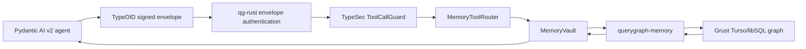

# MEMORY — Marciana: capability-secured memory for AI agents

*Design date: 2026-07-04 · Author: Claude (Fable) with Alexy · Consolidated:
2026-07-14 · Status: canonical TypeSec security design and realized v1 record;
the standalone Marciana extraction is accepted and owns active product work ·
Codename: **Marciana** (the Biblioteca
Marciana — Venice's great library; the memory subsystem gets a Venetian name
of its own, distinct from the release codename line).*

Typesec learns to remember. This document designs an AI memory subsystem in
the mold of the best OSS memory systems — mem0's extraction/consolidation
loop, Zep's bi-temporal knowledge graph, cognee's ECL pipeline — but with the
property none of them have: **safe, granular, uniform access control**, built
from the primitives typesec already ships (capabilities, SecLib-style labeled
values, ODRL purpose/retention constraints, the interop tool-call plane) and
stored, at scale, on Grust.

### Document role

This is the canonical TypeSec security design for Marciana. It owns the vault
invariants, trust boundaries, and realized v1 architecture recorded here. The
standalone Marciana repository owns the active product design, roadmap,
compatibility matrix, and integration delivery; §6 remains historical design
and acceptance input, not a competing live roadmap. The historical filename was
`FABLE-MEMORY-1.md`; this consolidation intentionally replaces it rather than
maintaining two competing design documents.

The following companion documents and implementation surfaces remain useful
evidence. They are mentioned here, not duplicated or modified by this
consolidation:

| Surface | Role |
|---|---|
| [`CLAUDE.md`](CLAUDE.md) | TypeSec repository guidance and concise implementation status |
| [`CHANGELOG.md`](CHANGELOG.md) | Release-oriented record of shipped TypeSec behavior |
| [`MARCIANA-PROJECT.md`](MARCIANA-PROJECT.md) | Accepted TypeSec-side handoff for the standalone Marciana boundary and extraction |
| [`MARCIANA.md`](MARCIANA.md) | Dated Cognee Rust and Akka/Fluree comparative review and delivery record |
| [`../grust/docs/QUERYGRAPH_MEMORY_GOAL.md`](../grust/docs/QUERYGRAPH_MEMORY_GOAL.md) | Grust-side durable-backend goal, verification commands, and implementation evidence |
| [`../grust/docs/lancedb-backend-plan.md`](../grust/docs/lancedb-backend-plan.md) | Existing Grust LanceDB backend plan and substrate detail |
| [`../grust/docs/sail-backend-proposal.md`](../grust/docs/sail-backend-proposal.md) | Existing Sail/Spark backend proposal and operational assumptions |
| [`../grust/docs/GQL_PROFILE_STATEMENT.md`](../grust/docs/GQL_PROFILE_STATEMENT.md) | Implemented Grust GQL profile; evidence that future work is memory-specific pushdown |
| [`../querygraph/qg-rust/docs/memory-service.md`](../querygraph/qg-rust/docs/memory-service.md) | qg-rust operational runbook and HTTP contract |
| [`../querygraph/qg-rust/docs/guide/manuscript.md`](../querygraph/qg-rust/docs/guide/manuscript.md) | Broader QueryGraph stack guide |
| [`../querygraph/qg-python/querygraph/pydantic_ai_capabilities.py`](../querygraph/qg-python/querygraph/pydantic_ai_capabilities.py) | Executable Pydantic AI v2 credential and memory capabilities |
| [`../querygraph/qg-python/examples/pydantic_ai_v2_memory_agents.py`](../querygraph/qg-python/examples/pydantic_ai_v2_memory_agents.py) | Restart-persistence and outsider-denial demonstration |

Those documents may preserve narrower wording or references to the historical
filename. This document is authoritative for TypeSec's Marciana security
contract; owning source code, tests, and CI remain authoritative for implemented
behavior.

---

## 1. Why memory, and why typesec is the right home

Memory is the highest-value asset an agent accumulates. Everything sensitive
an agent ever sees — PII, credentials pasted into a conversation, medical or
financial context, another tenant's data — flows toward its memory, and then
back out into prompts. The OSS state of the art treats access control as a
`user_id` filter on a query: any in-process bug, prompt injection, or
mis-scoped retrieval silently crosses tenants. And memory creates a *new*
attack class the tool-call guard alone can't stop: **memory poisoning** —
a prompt injection that persists itself as a "fact" today and fires in a
different session next week.

| | mem0 | Zep (Graphiti) | cognee | **Marciana** |
|---|---|---|---|---|
| Memory model | facts + ADD/UPDATE/DELETE loop | bi-temporal knowledge graph | ECL pipeline → graph + vectors | records + bi-temporal entity graph |
| Scoping | `user_id` filter | `group_id` filter | dataset filter | **capability per memory space** (unforgeable, minted, expiring) |
| Sensitivity | none | none | none | **type-level labels** (`SecureValue`, join-lattice) |
| Purpose / retention | none | none | none | **ODRL constraints** (purpose-bound recall, retention windows) |
| Deletion | best-effort delete | edge invalidation | delete | **audited tombstones + signed deletion receipts** |
| Poisoning defense | none | none | none | **provenance labels + quarantine + declassify-to-trust** |
| Agent surface | SDK calls | SDK calls | SDK calls | **guarded tool calls** — the same deny-by-default plane as every other tool, across OpenAI/Anthropic/LangChain/Pydantic-AI/MCP |

Every row in the last column is a primitive typesec already has. That is the
argument for building it here: Marciana is not a new security system bolted
onto a memory store; it is the existing security system *applied to* a memory
store. The SecLib fit in particular is exact: consolidation (merge, dedup,
summarize) is `map`/`zip` over labeled values, and the `Join` lattice gives
the only correct answer for free — *a summary of a Sensitive memory is born
Sensitive*; merging Internal with Secret yields Secret. No memory system on
the market gets this right because none of them has an information-flow type
system to get it right *in*.

## 2. Design principles

1. **Memory is a resource; access is a capability.** A memory space has a
   resource id; reading, writing, and forgetting it require
   `Capability<CanRead|CanWrite|CanDelete, MemorySpace>`, minted through a
   `PolicyEngine` like every other capability — audited, expiring, revocable,
   attenuable. There is no unauthenticated application path to memory contents;
   raw persistence access remains a trusted infrastructure seam.
2. **Contents are labeled, not just scoped.** Every record's content lives in
   a `SecureValue<L, MemoryContent, MemorySpace>`. Scope says *whose* memory;
   the label says *how hot* it is. Both gates apply independently.
3. **Recall declares its clearance.** You don't "search memory"; you recall
   *into a context of a stated sensitivity ceiling*. What exceeds the ceiling
   isn't returned in cleartext — it surfaces as redacted metadata, revealable
   only with the stronger capability.
4. **The model's hands are gloved.** When the *LLM* wants to remember, recall,
   or forget, those are tool calls — routed through the existing
   `ToolCallGuard`, deny-by-default, in all five dialects. Memory gets no
   private side door around the interop plane.
5. **Provenance is security metadata.** Where a memory came from (verified
   TypeDID envelope ≻ human operator ≻ guarded tool output ≻ raw model text)
   determines its birth label and whether it can enter high-trust recall
   without an explicit, audited promotion.
6. **Forgetting is provable.** Deletion writes an audited tombstone and can
   mint a signed deletion receipt (ed25519, offline-verifiable) — the GDPR
   erasure story is a first-class flow, not a `DELETE FROM`.
7. **Storage is a trait; cognition is pluggable.** TypeSec owns the security
   semantics and reference stores. Grust persistence, Sail compute, and
   LakeCat proof remain reusable substrates; standalone Marciana owns the
   memory-specific composition, and QueryGraph consumes it. None is a hard
   TypeSec dependency.

## 3. Core model

### 3.1 Spaces and records

```text
memory/<owner>/<space>[/<record-id>]
  memory/user:alice/profile          — durable facts about Alice
  memory/user:alice/episodic         — conversation episodes
  memory/agent:planner/procedural    — learned procedures/skills
  memory/team:support/semantic       — shared knowledge, entity graph
```

A `MemorySpace` implements `Resource` with that id scheme, so **existing
policy engines govern memory with zero new machinery**: RBAC globs
(`memory/user:alice/**`), the graph engine for org-shaped sharing, ODRL for
purpose and time. Capabilities are minted per space; per-record granularity
comes from record ids in the resource path plus per-record labels.

```rust
pub struct MemorySpace { owner: SubjectId, space: String }   // Resource impl

pub struct MemoryRecord {
    pub id: MemoryId,
    pub kind: MemoryKind,          // Episodic | Semantic | Procedural | Profile
    pub content: SecureValue<_, MemoryContent, MemorySpace>,  // label-erased at rest, see 3.3
    pub entities: Vec<EntityRef>,  // hooks into the knowledge graph
    pub provenance: Provenance,    // Conversation | GuardedTool{tool, call_id} | Envelope{id} | Operator | ModelText
    pub observed_at: DateTime<Utc>,   // when we learned it
    pub valid_from:  DateTime<Utc>,   // when it became true   (bi-temporal, Zep-style)
    pub invalid_at:  Option<DateTime<Utc>>, // when it stopped being true
    pub expires_at:  Option<DateTime<Utc>>, // retention deadline
    pub purposes: Vec<String>,     // ODRL purpose tags it may serve
}
```

Bi-temporality is Zep's best idea and we take it wholesale: facts are never
overwritten, they are *invalidated* — "Alice lives in Venice (valid 2023→2026)"
survives next to its successor. Consolidation supersedes; only `forget`
destroys.

### 3.2 The vault: capability-gated operations

```rust
pub struct MemoryVault<S: MemoryStore> { store: S, engine: Arc<dyn PolicyEngine>, /* … */ }

impl<S: MemoryStore> MemoryVault<S> {
    /// Write: requires CanWrite on the space. The draft's provenance fixes
    /// its birth label (see 3.4); the record enters quarantine if untrusted.
    pub fn remember(
        &self, space: &MemorySpace,
        cap: &Capability<CanWrite, MemorySpace>, draft: MemoryDraft,
    ) -> Result<MemoryId, MemoryError>;

    /// Read at a declared clearance ceiling L: returns only records whose
    /// label ⊑ L, as SecureValue<L, …> (join-folded). Hotter hits come back
    /// as RedactedHit { id, kind, label, entities } — visible that they
    /// exist, unreadable without escalation.
    pub fn recall<L: Clearance>(
        &self, space: &MemorySpace,
        cap: &Capability<CanRead, MemorySpace>, query: RecallQuery,
        ctx: &RequestContext,
    ) -> Result<Recall<L>, MemoryError>;

    /// Escalate one redacted hit: the sensitive-read capability must cover
    /// the specific record's resource id (mirrors SecureValue::reveal).
    pub fn reveal(
        &self, space: &MemorySpace,
        cap: &Capability<CanReadSensitive, MemorySpace>, id: &MemoryId,
    ) -> Result<MemoryContent, MemoryError>;

    /// Consolidate: merge/supersede/summarize a set of records. Labels join;
    /// superseded records get invalid_at, not deletion. Runs atomically
    /// (grust 0.12 transactions on the graph backend).
    pub fn consolidate(
        &self, space: &MemorySpace,
        cap: &Capability<CanWrite, MemorySpace>, plan: ConsolidationPlan,
    ) -> Result<ConsolidationReport, MemoryError>;

    /// Forget: destructive, audited, tombstoned; optionally mints a signed
    /// deletion receipt via typesec-integrations::receipt.
    pub fn forget(
        &self, space: &MemorySpace,
        cap: &Capability<CanDelete, MemorySpace>, selector: ForgetSelector,
    ) -> Result<Tombstone, MemoryError>;
}
```

Key decisions baked into these signatures:

- **`recall<L>` is the SecLib move.** The clearance is a *type parameter*: the
  caller states the sensitivity of the context the memories will flow into
  (a prompt bound for an external model is `Public`/`Internal`; an in-house
  audit tool may recall at `Sensitive`). The result is typed at that ceiling,
  so downstream code cannot accidentally treat hot memories as cool ones —
  the compiler carries the ceiling.
- **`RequestContext` flows through recall**, so ODRL purpose constraints bind
  per-query: a space whose policy says `purpose eq "support"` simply returns
  nothing to an analytics query. Purpose-bound memory is a policy line, not
  application code.
- **Delegation is attenuation.** A planner hands a sub-agent
  `cap.coerce::<CanRead>().attenuated(Duration::from_secs(300))` — read-only,
  five minutes, one space. Cross-process, the same grant travels as a signed
  receipt or inside a TypeDID envelope.
- **New sealed permission, one addition:** `CanForget`? No — `CanDelete`
  already exists and maps exactly. We add **no new permission markers** in M1;
  if quarantine-promotion proves to need its own authority, `CanDeclassify`
  is already there and semantically correct.

### 3.3 Labels at rest

`SecureValue`'s label is compile-time; a store holds mixed-label records. At
rest each record carries a **runtime label tag** (`Public | Internal |
Sensitive | Secret`); the vault is the only application component that reveals
content, and it re-wraps into the statically-typed `SecureValue<L>` *only* when
the record's runtime label ⊑ the recall ceiling `L`. Direct content field access
is `pub(crate)` inside typesec-memory — exactly the `new_minted` pattern: one
guarded application construction site, with compile-fail tests to keep it that
way. Store serde, record `Debug`, and raw store handles are trusted
plaintext-bearing persistence surfaces, not alternate application APIs.

### 3.4 Provenance, taint, and memory poisoning

Birth labels by source (defaults, policy-overridable):

| Provenance | Birth label | Quarantined? |
|---|---|---|
| Verified TypeDID envelope (signature, identity, and request binding passed; durable replay profile when available) | as declared by sender profile | no |
| Human operator / explicit API | as declared | no |
| Guarded tool output (`GuardedToolCall::protect_output` taint) | tool resource's level | no |
| **Raw model text / unguarded extraction** | `Internal` | **yes** |

Quarantined records are recallable only with an explicit query flag (default
**off**) and must be excluded from consolidation into durable spaces until
**promoted**—an explicit, audited act requiring `CanDeclassify` on the
space. This is the anti-poisoning valve: an injected "fact" can enter the
episodic log, but it cannot silently become long-term truth that steers
future sessions. The extraction pipeline (3.6) writes *through* this valve,
never around it.

That paragraph is the normative target. V1 implements provenance-based birth
quarantine and default exclusion, and the agent tool surface does not expose an
`include_quarantined` flag. It does not yet expose a `promote` operation or
require `CanDeclassify` when a direct Rust caller explicitly includes a
quarantined record. Before hosted service, consolidation must propagate the
quarantine bit across every source unless an explicit promotion audit proves
`CanDeclassify`; the future implementation must add compile-fail and runtime
tests for that rule.

### 3.5 The knowledge graph on Grust

Semantic memory is a typed property graph — Grust's home turf:

```text
(:Entity {name, kind})-[:REL {fact_id, valid_from, invalid_at}]->(:Entity)
(:Episode {id, at})-[:MENTIONS]->(:Entity)
(:Record {id, label, space})-[:ASSERTS]->(:REL edge identity)
```

The last line is the logical model. V1 materializes entity-to-entity
`RELATES` edges without assertion identity; §6.3 replaces that physical shape
with explicit `MemoryAssertion` nodes so repeated facts retain independent
lineage.

- **Graph recall**: "what do we know about ACME?" is a GQL/Cypher
  neighborhood query; results map back to record ids, then through the vault's
  label gate — *the graph returns ids, the vault returns content*. Storage
  never becomes an authorization bypass.
- **Bi-temporal edges**: `valid_from`/`invalid_at` as edge properties;
  point-in-time recall ("what did we believe on June 1?") is a property
  predicate.
- **Atomic consolidation**: grust 0.12's transaction surface
  (`begin`/`add_statement`/commit) makes supersede-and-relink a single unit —
  no half-merged memories.
- **Policy synergy**: the *same* Grust instance can hold the org graph the
  `GraphPolicyEngine` evaluates — "share memories up the reporting line" is a
  policy that joins the memory graph and the org graph. No other stack can
  express that in one query engine.

### 3.6 Extraction & consolidation (the mem0 loop, gloved)

An `Extractor` trait turns raw episodes into `MemoryDraft`s and
`ConsolidationPlan`s (ADD / UPDATE(supersede) / NOOP decisions):

```rust
pub trait Extractor {
    fn extract(&self, episode: &Episode, existing: &[MemorySummary]) -> Result<Vec<MemoryDraft>, ExtractError>;
    fn plan(&self, drafts: &[MemoryDraft], existing: &[MemorySummary]) -> Result<ConsolidationPlan, ExtractError>;
}
```

Reference impls: a deterministic `RuleExtractor` (tests, air-gapped use) and
an `OllamaExtractor` in typesec-integrations (the `DidOllamaClient` plumbing
already exists — extraction can run against a *local* model so raw sensitive
episodes never leave the boundary; that's a differentiator worth advertising).
Extractor output is drafts, not writes: everything still enters through
`remember`/`consolidate` with capabilities, labels, and quarantine applied.
The extractor is untrusted by construction.

### 3.7 Storage trait and reference stores

```rust
pub trait MemoryStore: Send + Sync {
    fn put(&self, record: StoredRecord) -> Result<(), StoreError>;
    fn get(&self, id: &MemoryId) -> Result<Option<StoredRecord>, StoreError>;
    fn query(&self, q: &StoreQuery) -> Result<Vec<StoredRecord>, StoreError>;   // filters: space, kind, time, label≤, entities, text
    fn invalidate(&self, id: &MemoryId, at: DateTime<Utc>) -> Result<(), StoreError>;
    fn tombstone(&self, id: &MemoryId) -> Result<bool, StoreError>;
    fn apply_batch(&self, ops: Vec<StoreBatchOp>) -> Result<(), StoreError>;    // default sequential; transactional backends override
    // graph hooks (default: unsupported)
    fn link(&self, ...) -> Result<(), StoreError> { Err(StoreError::Unsupported) }
    fn neighborhood(&self, ...) -> Result<Vec<MemoryId>, StoreError> { Err(StoreError::Unsupported) }
}
```

- `InMemoryStore` — always available; tests, demos, WASM.
- `GrustMemoryStore` — behind a `graph-memory` feature (same pattern as
  typesec-rbac's `graph` feature).
- **Vector search is deliberately *not* in the trait's core.** An optional
  `SemanticIndex` trait (embed + ANN) plugs in beside it; the reference impl
  can use Ollama embeddings, and the scale implementation belongs to the
  standalone Marciana project (§5).
  Marciana's guarantees must hold on `query` alone — semantic search is a
  *ranking* upgrade, never an authorization path.

## 4. Ecosystem integration (the "uniform across typesec" requirement)

- **Interop plane**: ship standard tool bindings — `memory.recall` /
  `memory.remember` / `memory.forget` with `resource_arg: space` — so
  LLM-initiated memory ops are guarded tool calls in all five dialects, are
  hidden by policy-aware tool listing when the subject has no memory rights,
  stream-scrubbed by `typesec proxy`, and gated by `typesec mcp-gate` when
  memory is served over MCP. A `#[typesec_tool]`-annotated reference handler
  makes the binding one declaration.
- **MCP memory server**: `typesec memory-serve` — an MCP server over a vault,
  so *any* MCP-speaking host (Claude, IDEs) gets capability-secured memory by
  pointing at it (optionally fronted by mcp-gate for a second subject's view).
- **Python**: `MemoryGate` in typesec-python mirroring `ToolGate`
  (`remember/recall/forget/consolidate`, clearance as a string, results as
  dicts with `label` + `redacted` flags) + `typesec.adapters` helpers so
  mem0-style call sites port in minutes.
- **WASM**: `WasmMemoryVault` over `InMemoryStore` — session-scoped secure
  memory for JS/edge agents (no Grust on wasm; the trait split makes this
  free).
- **Receipts & TypeDID**: memory grants travel as attenuated capabilities
  serialized to receipts; deletion receipts prove erasure to a counterparty;
  TypeDID envelopes carry cross-agent memory shares end-to-end encrypted.
- **Audit/observability**: every vault op is an `AuditEvent`
  (`memory:read|write|delete|promote` action names) → the OTel sink, decision
  logs, and `typesec replay` work unchanged — *replay a proposed policy change
  against last month's actual memory-access log* before rollout.
- **Conversation typestate**: `Conversation<Consented>` is the natural
  carrier for "this peer consented to being remembered" — `remember` for
  peer-derived facts can require the consent capability. (M5, optional.)

## 5. Placement: TypeSec vs standalone Marciana

**Marciana's security core belongs in TypeSec; its product, scale, and
cognition tier belongs in the standalone Marciana project as part of the
QueryGraph stack.** Concretely:

**typesec (this repo) — crate `typesec-memory` (workspace member #11):**
types, `MemorySpace`, the vault, labels-at-rest, quarantine, `MemoryStore` +
`SemanticIndex` traits, `InMemoryStore`, `GrustMemoryStore` (feature-gated,
same as rbac's grust dep), interop bindings, `memory-serve`, Python/WASM
surfaces, receipts/audit wiring. Rationale: the invariants (one guarded
application reveal path, capability-gated ops, label joins) are compile-time
properties that must live next to the sealed traits and compile-fail tests that
enforce them.

**Standalone Marciana project:** everything about the four-verb product,
scale, cognition, and memory-specific adapters, implementing TypeSec's traits
from the outside. The current `querygraph-memory` crate is the
behavior-preserving extraction source, not its permanent repository owner:

- **`SemanticIndex` at scale** — embedding pipelines and ANN over sail
  (DataFusion / Lance / Spark-sized corpora), hybrid BM25+vector+graph
  ranking à la Zep.
- **Graph analytics** — entity resolution, community detection/summaries
  (Graphiti-style), contradiction detection between records, decay/importance
  scoring — batch jobs over grust-sail, feeding `ConsolidationPlan`s back
  through the vault's front door.
- **Point-in-time & lineage queries as GQL library functions** — this
  pressure-tests grust's new GQL/transaction features with a real workload,
  which is good for Grust itself.
- **Multi-tenant memory service** — a hosted Marciana product consumed by
  QueryGraph: one Grust cluster, many vaults, TypeSec policies as the tenancy
  boundary. This is where "memory as a service, with provable isolation"
  becomes a product story neither mem0 nor Zep can tell.

The seam is clean because it is the seam we already operate: TypeSec defines
the security contract, Grust supplies generic graph persistence, Sail supplies
generic compute, and LakeCat supplies governed catalog evidence. Marciana
composes those owners without becoming a second authority or store.

### 5.1 Historical QueryGraph handoff (`querygraph-memory`)

The current extraction source implements this contract against
`typesec-memory`; Marciana retains it during the behavior-preserving move:

- **Traits to implement:** `MemoryStore` (required) and `SemanticIndex`
  (optional, for ANN/hybrid ranking). Both are `Send + Sync`, take
  `StoredRecord`/`StoreQuery` by value/ref, and must **never** expose record
  content (the field is crate-private in `typesec-memory`; QueryGraph stores
  persist `StoredRecord` via its `Serialize`/`Deserialize` and hand it back
  whole — the vault does all content access). The Grust reference store
  (`GrustMemoryStore`, M4) is the conformance template.
- **Invariants a backend must preserve** (checked by a shared conformance
  suite QueryGraph runs): `query` honors every `StoreQuery` field with the
  documented semantics (label ceiling, bi-temporal `valid_at`, quarantine,
  purpose overlap); `invalidate` sets `invalid_at` without destroying;
  `tombstone` destroys and returns existence; `neighborhood` returns only ids
  reachable within `hops`. A backend that *widens* any filter fails the
  suite.
- **Fixtures:** `typesec-memory` ships (in `tests/`) a corpus of records +
  expected `query`/`neighborhood` results as JSON; `querygraph-memory` runs
  the same corpus. "Marciana-compatible" is thereby checkable.
- **What standalone Marciana owns on top** (not in the trait, layered beside
  it):
  embedding pipelines feeding `SemanticIndex`, entity resolution and
  community summaries as batch jobs over grust-sail that emit
  `ConsolidationPlan`s back through the vault's front door, point-in-time and
  lineage queries as GQL library functions, and the multi-tenant hosted
  service (typesec policies as the tenancy boundary).
- **Versioning:** `querygraph-memory` tracks `typesec-memory`'s minor version;
  a trait change is a minor bump in both, and the conformance fixtures carry
  a schema version so a backend can assert compatibility at build time.
- **The sync/async seam (decided 2026-07-04):** `MemoryStore` stays
  **synchronous** — the vault is sync, wasm-friendly, and its invariants are
  easiest to audit without an executor in the loop. Grust's `GraphStore` is
  `async_trait`, so `querygraph-memory` owns the bridge: each backend impl
  holds a runtime handle and `block_on`s inside its `MemoryStore` methods.
  One sanctioned bridge in one crate, not N ad-hoc ones.

### 5.2 Historical QueryGraph work plan (repo surveyed 2026-07-04)

A survey of the grust repo sharpened the plan in three ways.

**Naming:** the crate name `grust-memory` is **taken** — it is grust's
deterministic *in-RAM `GraphStore` backend*, unrelated to AI memory. The AI
memory tier is therefore `querygraph-memory`, unambiguous and product-scoped.

**Substrate that already exists** (more than this design assumed): grust's
async `GraphStore` trait with persistent backends (`grust-postgres`,
`grust-falkor`, `grust-helix`, `grust-surreal`, `grust-turso`,
`grust-pggraph`), **`grust-lancedb`** (LanceDB — a vector store — as a
`GraphStore` backend, the natural ANN substrate), `grust-sail` (Spark
Connect, the batch tier), and `grust-cocoindex` (target-state export
pipelines). The 0.12 "Lobster" release adds the transaction surface and the
Full39075 GQL completion (index DDL, graph type DDL, catalog metadata, named
graph selection, session control, path values) that §5.2's items pressure-test.

**Tier 1 — typesec-side prerequisites (this repo; done on `fable/memory`):**

1. The **`SemanticIndex` trait** now exists (`typesec_memory::index`):
   `index(id, label, text)` / `remove(id)` / `search(query, limit) -> ids`.
   It is id-in/id-out — search can *rank*, only the vault *reveals* — and it
   receives each record's `Label` so implementations can enforce the
   embedding-privacy rule: content labeled above `Internal` must never be
   sent to a remote embedder. This is a documented trait contract and is
   enforced by QueryGraph's v1 vector index. A deterministic `KeywordIndex`
   reference impl ships with it,
   and `MemoryVault::with_index` + `recall_semantic` wire ranking into the
   vault behind the same label gate as every other recall path.
2. The **conformance suite** now ships: `typesec_memory::conformance`
   (feature `conformance`) embeds a versioned JSON corpus + expected results
   and runs any `MemoryStore` through query semantics (space/label/validity/
   quarantine/purpose/entity/text), invalidate/tombstone behavior, and —
   for graph stores — neighborhood reachability. `InMemoryStore` and
   `GrustMemoryStore` both pass it in-tree; `querygraph-memory` runs the same
   harness per backend in its CI. "Marciana-compatible" is now a test, not a
   claim.
3. The **seam decision** above (sync `MemoryStore`, bridge lives in
   `querygraph-memory`).

**Tier 2 — `querygraph-memory` v1 — DONE** (landed on Grust main, with library,
tenant-isolation, persistent-Turso, and strict Clippy coverage).
V1 is the reusable contract and reference layer needed to connect Marciana to
the QueryGraph stack. It deliberately does not claim the native LanceDB, Sail,
or hosted-product work listed as post-v1 below.

1. *Persistent, incremental `MemoryStore`* over any Grust `GraphMutationStore`
   — **done.** `GraphStoreMemoryStore<G>`: records/entities as nodes,
   `MENTIONS`/`RELATES` edges written incrementally; neighborhood recall via
   `traverse`. Owns the sanctioned sync→async bridge (dedicated runtime,
   scoped thread when already inside tokio — MCP-safe, tested). Passes the
   full conformance corpus incl. graph reachability.
2. *Transactional consolidation* — **done.** `MemoryStore::apply_batch`
   (added to typesec-memory: `StoreBatchOp`, default sequential) maps the
   whole supersede-and-relink plan to one grust `apply_mutations` call, atomic
   on any backend that overrides it transactionally. The vault's
   `consolidate` emits one batch; an end-to-end test supersedes over the
   Grust backend with the SecLib join preserved.
3. *Space-filter pushdown* — **v1 done.** `query` starts from
   `Start::NodesByProperty` on the record's `space` prop, so a scoped query is
   pushed to the backend and never scans other tenants. Shared
   `StoreQuery::matches` semantics preserve correctness for the remaining
   dimensions. Native GQL point-in-time and lineage predicate pushdown is a
   post-v1 optimization.
4. *Vector `SemanticIndex`* — **v1 done.** `VectorIndex<E: Embedder>` with the
   embedding-privacy rule **enforced by construction**: `Embedder::is_local`,
   and above-`Internal` content is only ever embedded locally (a remote
   embedder declines to index it — content never egresses). Cosine ranking +
   an optional bounded hybrid graph re-rank (co-mentioned entities) provide the
   reference implementation. A persistent native LanceDB ANN adapter is
   post-v1; supplying an `Embedder` alone is not that adapter.
5. *Cognition batch analytics* — **v1 done.** `analytics`: dedup, contradiction
   detection, decay/importance scoring — whose **only output is a
   `ConsolidationPlan` applied through the vault front door**, never a direct
   store write. An end-to-end test runs a contradiction plan through the vault.
   Distributed production implementations over `grust-sail` are post-v1; the
   plan-producing contract is the durable v1 boundary.
6. *Multi-tenant isolation* — **v1 done.** Integration test: one shared Grust
   store behind two vaults, typesec policies as the tenancy boundary — a
   tenant can neither mint a capability for nor point its own capability at
   another tenant's spaces, despite records sharing one graph. A hosted
   multi-tenant service and additional product clients beyond the delivered
   Pydantic AI v2 demonstrator are post-v1 application work; the `qg-rust`
   consumption path is the v1 completion proof described below.

**Post-v1 scale and product work (not required to call v1 complete):**

- durable envelope anti-replay state shared by every qg-rust replica;
- native GQL temporal/lineage predicate pushdown and edge-property indexes for
  bi-temporal windows;
- a persistent `SemanticIndex` backed by `grust-lancedb`'s native ANN surface,
  including a real embedding/indexing pipeline;
- distributed consolidation analytics implemented as `grust-sail` jobs;
- persistent-backend integration matrices beyond the current v1 Turso proof;
  and
- hosted multi-tenant service assembly plus product packaging and clients
  beyond the delivered qg-python Pydantic AI v2 demonstration.

Section 6 preserves the historical design and acceptance input for these
workstreams; the standalone Marciana project owns their current status and
sequencing. This list only preserves the boundary established during v1.

**V1 completion delivery (done on 2026-07-14):** `querygraph-memory` passes the
TypeSec conformance corpus against persistent Turso, including reopen,
transactional consolidation, and nested-Tokio tests. `qg-rust` exposes
signed-only remember/recall/forget routes whose TypeSec subject is the
credential's verified `did:key`; qg-python demonstrates two Pydantic AI v2
capabilities—access credentials and Marciana memory—across a server restart,
plus outsider denial. This does not pull the deferred native GQL, LanceDB,
Sail, or hosted-service implementations into v1.

**Tier 3 — post-v1 Grust enablers:** edge-property indexes tuned for
bi-temporal predicates and an ANN interface beyond the plain `GraphStore`
surface. These should be driven by the GQL and LanceDB implementations rather
than added speculatively.

**Historical order:** TypeSec prerequisites (done) → QueryGraph reference adapter (done) →
persistent Turso + `qg-rust` + Pydantic AI v2 consumption proof (done) →
durable anti-replay and schema-migration foundations → GQL temporal/lineage
pushdown → LanceDB ANN → Sail analytics → hosted service and additional
clients.

### 5.3 Realized v1 cross-stack architecture

V1 is a complete vertical slice, not merely a set of compatible crates. The
same TypeSec invariants are exercised through a durable store, a network
service, and real agent capabilities:



| Boundary | V1 design |
|---|---|
| Agent dependencies | A private signing seed stays in `QueryGraphAgentDeps`; model context receives tools, public identity, and governed results only |
| Transport identity | qg-python signs an Ed25519 TypeDID envelope; qg-rust accepts the signing `did:key` as the policy subject only when it equals the verification-method DID |
| Request binding | The signature covers sender, recipient, action, path resource, and a payload hash whose `bodySha256` binds the exact HTTP body |
| Policy gate | `ToolCallGuard` denies by default and normalizes the memory tool request before any capability is minted |
| Typed authority | `MemoryToolRouter` mints the operation-specific capability and enters `MemoryVault`; a JSON `subject` field has no authority |
| Information flow | The vault alone reveals content to applications, applies purpose and clearance, preserves quarantine, joins labels, and emits audit events; raw persistence remains trusted |
| Persistence | `TursoMemoryStore` stores opaque `StoredRecord` JSON plus entity graph structure in bootstrapped Grust universal tables |
| Runtime seam | `querygraph-memory` owns the single sync-to-async bridge, including I/O/time drivers, nested-Tokio calls, and async-context-safe shutdown |

The qg-rust memory routes are always authenticated, even when compatibility
mode leaves older governed routes open:

```text
POST /v1/memory/remember
POST /v1/memory/recall
POST /v1/memory/forget
```

The authorization profile requires `recipient = did:web:qg-server`,
`action = invoke`, an exact path match, an exact body digest, a valid Ed25519
signature, and `sender == verification_method DID`. Authentication failures
are `401`; TypeSec policy denials are `403` receipts; a signed request to a
server without memory configured receives `503`. The service performs blocking
vault work away from async workers.

`TursoMemoryStore::open(path)` creates missing parent directories, uses the
stable `querygraph_memory` table prefix, connects, and bootstraps before it
returns. `open_with_config` permits explicit prefixes, batching, and journal
mode. The durable proof covers close/reopen, the complete TypeSec conformance
corpus, transactional supersede-and-replace with SecLib label joining, graph
neighborhoods, and construction/use/drop from inside an existing Tokio
runtime.

The qg-python demonstrator attaches two native Pydantic AI v2 capabilities to
each agent:

- `querygraph.typedid-credential` exposes public identity and signed governed
  access while keeping credential material in typed runtime dependencies;
- `querygraph.marciana-memory` exposes remember, recall, and forget through the
  same identity-bound service.

The executable story imports a real Croissant model, obtains a governed
qg-rust answer, stores it as a specialist, terminates and restarts qg-rust,
recalls the same record as a differently credentialed supervisor, and records
the `403` receipt for an unassigned but validly signed outsider. `TestModel`
makes this deterministic and provider-key-free; the capabilities themselves
remain usable with production models.

V1 intentionally stops at a durable local service proof:

- only space equality is pushed to the graph backend; other `StoreQuery`
  dimensions use the shared conformance-pinned matcher;
- vector ranking is in-process and non-persistent;
- cognition functions are reference algorithms that emit plans, not
  distributed Sail jobs;
- envelope signatures are recipient/path/body/identity bound, but a replay
  nonce is not durably claimed;
- tenant isolation is enforced by TypeSec at the vault boundary rather than
  by hosted control-plane and physical-partition machinery; and
- `MemoryId::next()` is monotonic only within one process, so a server that
  writes again after process restart can collide with persisted ids unless the
  durable-id contract is upgraded; and
- the v1 `querygraph-memory` `RELATES` link/delete path uses structural
  `(from, label, to)` identity, so it cannot retain multiple same-endpoint,
  same-label assertions solely by varying `fact_id`, even though Grust's core
  edge model can carry explicit ids.

Those limits define the post-v1 work below. They do not reopen the completed
v1 contract.

## 6. Historical post-v1 scale and service design

This section records the design and acceptance input that led to the standalone
Marciana project. Its non-regression rules remain binding on TypeSec
integrations, but active sequencing and status now live in Marciana. None of
this work is required to describe v1 as complete, and no implementation may
move authorization into a faster backend.

### 6.1 Non-regression invariants

Every post-v1 implementation must preserve all of these rules:

1. **The vault remains the only content authority.** Graph, vector, and batch
   systems return ids, scores, metadata, or `ConsolidationPlan`s—never
   independently authorized plaintext.
2. **Acceleration may narrow or reorder, never widen.** Every candidate is
   rechecked against space, purpose, clearance, quarantine, validity, and the
   current policy before reveal.
3. **Tenant identity is derived from verified credentials.** Body fields,
   headers outside the signed profile, model output, and caller-supplied tenant
   ids cannot choose the policy subject or partition.
4. **Labels follow data into derived systems.** Embeddings, summaries,
   communities, contradiction findings, caches, backups, and exports inherit
   the join of their sources and the same retention/deletion obligations.
5. **Quarantine is derived-data taint.** Any result influenced by a
   quarantined source stays quarantined unless a separately authorized,
   audited `CanDeclassify` promotion succeeds.
6. **Sensitive text and queries do not egress implicitly.** Above-`Internal`
   content or query text requires a local embedder unless an explicit policy
   authorizes a named remote processor.
7. **Mutation returns through the vault.** ANN maintenance can update its own
   index, but memory creation, supersession, promotion, and deletion always use
   capability-gated vault operations.
8. **Correctness has one oracle.** Pushdown and distributed implementations
   run the versioned TypeSec fixtures and compare with `StoreQuery::matches`
   and the reference analytics before replacing them.
9. **Failure is fail-closed and auditable.** Partial jobs, stale indexes,
   unavailable policy state, replay-store errors, and migration mismatches do
   not disclose content or silently downgrade enforcement.

### 6.2 Native LanceDB ANN

**Current baseline.** `VectorIndex<E: Embedder>` provides in-process cosine
ranking and a bounded entity co-mention boost. It refuses to send content above
`Internal` to a non-local embedder. It is a useful reference, but vectors do
not survive restart. `grust-lancedb` already supplies a persistent graph store
with typed mirror tables and traversal, but its tables contain scalar graph
fields and JSON properties rather than vector columns or ANN indexes. It
implements `GraphStore`/`GraphAdminStore`, not `GraphMutationStore`, and does
not yet expose the reusable vector-query surface required by `SemanticIndex`.
The intended role is a rebuildable semantic side index; Turso remains the
transactional memory source of truth.

**Target design.** Add a persistent `LanceDbSemanticIndex` beside the Grust
record store. It implements a scoped second-generation semantic-search
contract rather than treating a global top-k as sufficient:

```rust,ignore
pub struct SemanticSearchRequest<'a> {
    pub space_id: &'a str,
    pub query: &'a str,
    pub query_label: Label,
    pub candidate_ids: Option<&'a [MemoryId]>,
    pub limit: usize,
}
```

The scope and candidate set are optimization hints supplied only after the
vault authorizes the caller; they are not capabilities. The vault still fetches
and rechecks every returned id. This closes two weaknesses of a global top-k:
unauthorized records cannot consume the result budget, and a tenant query does
not scan another tenant's partition merely to discard those hits later.

The persisted vector row should minimally contain tenant/space partition,
`memory_id`, runtime label, embedding-model id and version, dimension,
content digest, vector, validity interval, and tombstone state. It must not
store plaintext memory content. Vectors are sensitive derived data: storage
encryption, backup policy, retention, and deletion follow the source label.
Model or dimension changes create a versioned reindex, never an in-place mixed
index.

Index writes remain best-effort with respect to primary memory durability, but
an outbox/reconciliation cursor makes them recoverable. `forget`, retention
reaping, and supersession enqueue removal/invalidation; a periodic audit
compares live records with indexed ids. Search over a stale index may lose
recall quality but cannot reveal stale content because the vault is final.
The adapter owns the same sanctioned sync/async seam as other
`querygraph-memory` backends rather than leaking Lance async calls into the
vault.

**Acceptance criteria:**

- restart-durable, idempotent upsert/removal and deterministic exact-search
  fixtures, plus a stated ANN recall-at-k floor;
- explain/telemetry evidence that native indexed nearest-neighbor search—not a
  Rust full-vector scan—executed;
- pre-ANN tenant/space filtering plus vault reauthorization of every id;
- local-only handling for above-`Internal` record and query text, with a test
  embedder proving that forbidden text never crosses the boundary;
- model-version and dimension migration with resumable reindexing;
- forget/reap/supersede propagation and a stale-index reconciliation test;
- no plaintext content in Lance rows, logs, metrics, or error messages; and
- an honest Grust/Lance API usable without reaching into backend internals.

### 6.3 Fuller GQL pushdown and assertion lineage

**Current baseline.** A scoped store query starts from
`Start::NodesByProperty(space)`, so one space does not require a full graph
scan. Kind, label ceiling, validity, quarantine, purpose, entity, text,
ordering, and limit are then evaluated with TypeSec's shared matcher. This is
semantically complete but leaves performance and point-in-time graph work on
the application side. Grust's general GQL layer is already Full39075 and its
Turso, PostgreSQL, and Sail backends already execute broad read pushdown. The
gap is specifically the memory adapter's metadata projection and backend-neutral
`StoreQuery` lowering—not an unfinished GQL implementation.

**Target design.** Introduce a typed `StoreQuery`-to-GQL lowering layer with a
capability table per backend. It pushes only predicates whose backend semantics
are proven equivalent and applies the shared matcher as a final defensive
filter. A narrow query-execution capability bridges the generic
`GraphStoreMemoryStore` to backend read-query implementations; unsupported
backends keep the current correct fallback. Versioned, approved query metadata
(kind, label, quarantine, observed/valid/invalid times) is projected beside the
opaque `StoredRecord` JSON. The first profile lowers:

- tenant and space equality;
- memory kind and runtime label ceiling;
- `valid_from <= valid_at` and `invalid_at > valid_at OR null`;
- quarantine inclusion/exclusion;
- entity membership through `MENTIONS` joins;
- deterministic ordering and limit; and
- neighborhood depth and point-in-time relationship validity.

`text_contains`, purpose overlap, and semantic ranking remain residual until an
opaque, backend-safe representation with equivalent semantics exists; protected
plaintext is not denormalized merely to claim full pushdown. Backend
`ORDER BY`/`LIMIT` is applied only after every membership-affecting predicate
has pushed, or through a correctness-preserving overfetch/continuation scheme.
Query plans expose pushed and residual predicates so operations can detect
accidental scans.

The lineage model must also stop encoding a fact only as an edge whose identity
is `(from, label, to)`. Reify every assertion:

```text
(:MemoryAssertion {fact_id, rel, observed_at, valid_from, invalid_at, label})
  -[:FROM]->(:MemoryEntity)
(:MemoryAssertion)-[:TO]->(:MemoryEntity)
(:MemoryRecord)-[:ASSERTS]->(:MemoryAssertion)
```

Two sources may then assert the same relationship independently; invalidating
or tombstoning one assertion leaves the other intact. Migration must retain
old relationship ids long enough to correlate audit and deletion receipts.
Assertion nodes carry source record id and space; neighborhood recall preserves
the current logical hop count despite the physical two-edge assertion path.
Already-overwritten v1 `fact_id` values cannot be reconstructed and the
migration report must state that explicitly.

**Acceptance criteria:**

- every versioned conformance query returns byte-equivalent ordered results
  with pushdown enabled and disabled;
- a differential matrix covers every pushed field, null invalidation,
  combinations, ordering ties, and limit-after-residual-filter cases;
- query-plan tests prove space/time predicates reach Turso before materializing
  records and prevent scoped full scans;
- point-in-time fixtures cover boundary instants, invalidated facts, and
  clock-normalized UTC values;
- repeated same-endpoint assertions coexist, carry distinct provenance, and
  can be invalidated independently while as-of traversal and logical hop
  semantics remain correct;
- interrupted schema migration resumes safely and can read the previous schema
  during the compatibility window; and
- Postgres, Turso, and the in-memory reference either pass the same profile or
  explicitly report unsupported pushdown without changing results.

### 6.4 Distributed Sail cognition

**V1 baseline (2026-07-14).** Deduplication, contradiction detection, decay, and
importance scoring run as deterministic reference functions. Their only output
is a `ConsolidationPlan`, and the vault applies that plan transactionally. This
is the correct control boundary but not a distributed implementation.
`grust-sail` already stages Arrow IPC into Spark Connect, runs Spark SQL,
returns Arrow IPC, stores Delta graph tables, performs graph mutations, and
executes broad read pushdown. At that baseline its mutation capability was
`OrderedNonAtomic`, and `querygraph-memory` had no Sail cognition runner,
durable job model, or distributed plan DTO.

**Handoff status (2026-08-05).** TypeSec's guarded cognition,
proposal-free recovery, and explicit `Mutated`/`NoChange` outcome protocol has
landed. A no-change result is not inferred from an empty ID list: it traverses
the complete binding, fresh-authority, source-reload, precondition, and
preparation path, then commits durable job/audit/outcome evidence with no
memory operation or index outbox row. Grust's generic live-Sail
execution, durable scheduling, ID-only outbox, and guarded-commit substrate is
being finalized in its owning repository. It has not yet been transplanted
into Marciana or consumed from there by qg-rust. The local Sail correction for
Delta `MERGE` non-null constraints is not yet a remotely reachable supported
revision.

**Target design.** Define versioned Arrow schemas for authorized cognition
input and proposal output, plus a serializable distributed DTO corresponding
to `ConsolidationPlan`. `grust-sail` jobs operate over an immutable, authorized
snapshot manifest. The manifest contains tenant/space, purpose, clearance,
snapshot time, candidate ids, schema version, policy-decision digest, and
input-label summary. It contains no reusable capability or private signing
material. The data reader applies the manifest partition before Spark sees
rows; Sail never receives an unrestricted shared-store scan.

Sending authorized text to Spark is still content egress. Above-`Internal`
inputs run only on a policy-approved local/private Sail deployment with the
required clearance, or the job is declined and the local reference path
remains available.

Jobs may compute entity resolution, communities, summaries, deduplication,
contradictions, decay, and importance. They emit a versioned proposal bundle:

```text
CognitionProposal {
  job_id, effect, input_snapshot, algorithm, algorithm_version,
  source_ids, source_digest, proposed_plan, joined_label,
  evidence, created_at
}
```

The proposal is inert. Standalone Marciana owns composition and orchestration;
`MemoryVault::apply_cognition` is the TypeSec reauthorization and application
boundary; Grust owns generic guarded persistence. Proposal schema 4 binds the
effect into canonical identity. Audit and signed receipt schema 2 carry the
same effect, and prepared-commit digest profile 4 binds it into backend
execution. `Mutated` requires nonempty canonical affected IDs and a memory
version transition; `NoChange` requires empty affected IDs and an unchanged
memory version, but both produce one durable, recoverable decision. qg-rust
remains a consumer during and after extraction. Stale proposals are rejected
or replanned, and Spark never writes the memory graph directly. Durable
scheduling records only job and proposal identity, cancellation, bounded
retries, metrics, and idempotent outcomes; protected proposal content remains
transient.

Schema 4 is the first supported executable proposal wire. Schema 1 is only the
in-memory state of an unbound Rust builder, not a serialized compatibility
format. Every wire must carry `effect`, and JSON ingress rejects missing-effect
documents plus every bound schema 1, 2, or 3 proposal rather than guessing or
promoting old semantics.

**Response-loss recovery.** TypeSec now exposes an authorized historical-result
path for a commit whose reply was lost. `MemoryVault` requires a current
`CanWrite` capability, configured policy, and complete purpose context before
looking up the exact space, job, and canonical proposal digest. It discloses
only a validated immutable `AlreadyApplied` outcome and audit: it does not
reconstruct a protected proposal, rerun mutation authority, or reapply the
operation. Absence, digest conflict, corrupt evidence, and backend failure all
collapse to the same unavailable result so the lookup cannot become a
cross-subject or adapter-error oracle. Marciana owns orchestration and receipt
projection around this TypeSec boundary.

**Acceptance criteria:**

- reference and Sail implementations agree on deterministic fixture outputs;
- an unauthorized space is absent before Spark execution, not filtered only
  after results return;
- above-`Internal` placement is accepted only for an approved private/local
  Sail deployment, with a negative egress test;
- summaries and communities inherit the join of all source labels and retain
  source provenance;
- job retry is idempotent by `job_id` and source digest;
- worker loss produces no partial memory mutation;
- stale-source and policy-revocation tests reject application of the proposal;
- explicit no-change results persist one recoverable audit/job/outcome while
  producing no record mutation or index outbox row;
- Arrow/Spark plans avoid collecting the full corpus into the driver; and
- applied proposals emit auditable lineage from every source record to every
  replacement;
- a live integration gate covers multiple partitions, retry, cancellation,
  service failure/restart, and authorization-negative cases; and
- plan/explain evidence demonstrates distributed execution on a representative
  scale fixture rather than a one-row connectivity query.

### 6.5 Persistent TypeDID anti-replay

**Current baseline.** The qg-rust HTTP profile verifies the Ed25519 signature,
requires the signing `did:key` to equal `sender`, and binds recipient, action,
path, and body digest. This prevents forgery, sender substitution,
cross-recipient use, cross-route use, and body substitution. It does not stop
the same valid envelope and body from being submitted again. The existing
`created_at` field is not sufficient because the v1 canonical signing payload
does not bind it and the server does not durably claim a nonce.

`conversation_id` is also outside the signature and normally derives from the
payload hash. The current profile does not bind HTTP method, canonical query,
host/deployment audience, or a freshness token. Its POST-only memory routes
reduce the immediate surface, but v1 is not a complete request-proof format.

**Target protocol.** Define a domain-separated `querygraph-http-auth-v2`
profile. Its signature covers protocol/profile version, sender and signing
DID, recipient/audience including environment, signed tenant selection (when
hosted), HTTP method, canonical path and query, exact body hash,
`conversation_id`, a cryptographically random nonce/JTI of at least 128 bits,
`issued_at`, `expires_at`, and an optional idempotency key. The service
cross-checks signed tenant selection against its credential registry; signing a
tenant id never grants membership.

The initial default lifetime should be two minutes with at most 30 seconds of
clock skew and a server-enforced maximum TTL. Production memory routes require
v2 after a documented transition; v1 remains opt-in only for local
compatibility.

qg-rust owns a small reusable `ReplayStore` boundary:

```rust,ignore
pub trait ReplayStore: Send + Sync {
    fn claim(&self, claim: ReplayClaim) -> Result<ClaimOutcome, ReplayError>;
    fn reap_expired(&self, before: DateTime<Utc>) -> Result<u64, ReplayError>;
}
```

`claim` atomically inserts a unique
`(tenant, audience, signer_did, nonce)` with expiry, request digest, method,
action, and resource. The production implementation uses a shared, strongly
consistent Turso/libSQL primary (or the hosted control database), not process
memory. Every replica uses that authority; a local cache may accelerate
negative checks but cannot accept a claim. The claim commits before the tool
call begins. Reuse with the same request digest returns a structured
`409 replay_detected`; reuse with another digest returns `401 nonce_reuse` and
raises a security event. Replay-store unavailability fails closed with `503`.
Claims remain through `expires_at + maximum_skew`, then are reaped in bounded
batches. Per-subject quotas prevent nonce-state exhaustion.

Nonce consumption and application idempotency are separate. Clients never
reuse a nonce for retries. A signed `idempotency_key` for mutations is keyed by
tenant, signer, operation key, and request digest; reuse with another digest is
a conflict. A completed duplicate may return the original receipt without
repeating the mutation, and `remember` should derive a stable record/command id
from that key. Claim, mutation, and completion receipt share a transaction
where possible; otherwise a durable command/outbox and recovery worker closes
the crash window. A simple claim-then-mutate sequence is at-most-once, not
exactly-once, and must not be advertised otherwise.

**Acceptance criteria:**

- an exact replay is rejected after server restart and by a different replica;
- two concurrent claims for one nonce yield exactly one success;
- the signed profile binds method, canonical query, deployment audience, and
  tenant selection as well as the existing path/body/identity fields;
- unsigned timestamps, expired envelopes, excessive clock skew, malformed
  nonces, sender/key mismatch, and replay-store failure are denied;
- the nonce is bound by the cross-language Rust/Python signing fixtures;
- expiry reaping and per-subject bounds prevent unbounded state growth;
- response-loss, crash, and failover tests prove mutation retries cannot create
  duplicate memories, while claim-only mode is described honestly as
  at-most-once; and
- denials emit audit-safe receipts without exposing secrets or cross-tenant
  state.

### 6.6 Hosted multi-tenant operations

**Current baseline.** One Grust store behind separate TypeSec vaults proves
logical policy isolation: a subject cannot mint or redirect a capability into
another space. It is not yet a hosted product. Global entity nodes can expose
structural timing or cardinality side channels, and there is no tenant control
plane, quota system, migration service, backup contract, or service-level
test matrix.

**Target architecture.** Separate the hosted system into a control plane and
data plane:

- the **control plane** owns tenant lifecycle, verified-DID membership, role
  assignments, policy versions, plan/quotas, billing metadata, schema
  migrations, key references, and audit configuration;
- the **data plane** serves the existing memory API, derives tenant and subject
  from the verified envelope and tenant registry, obtains a versioned policy
  decision,
  enters the tenant partition, and invokes the unchanged guard/router/vault
  chain; and
- async **workers** consume tenant-scoped index, retention, deletion,
  reconciliation, backup, and Sail-cognition jobs whose manifests carry no
  ambient authority.

Every node, edge, vector, replay claim, outbox item, audit event, backup object,
and job record gets an explicit `tenant_id` chosen by the server. Entity
deduplication is tenant-local by default. Shared tables use tenant-leading
keys and indexes; higher-assurance plans may select database-per-tenant or
encryption-key-per-tenant without changing the vault contract.

A DID may belong to more than one tenant. In that case the v2 envelope signs
the intended tenant/audience and the registry verifies membership; neither a
JSON body field nor an unsigned header can choose it. Tenant-prefixed entity
ids replace v1's global `ent:{name}` shape before hosted service claims are
made.

Operational requirements include:

- per-tenant storage, record, vector-byte, request-rate, concurrent-job, and
  retention quotas enforced before expensive work;
- envelope anti-replay shared across replicas, rate limiting, abuse controls,
  and key rotation/revocation;
- a transactional remote primary or equivalent authority, connection pooling,
  bounded concurrency, backpressure, replica failover, and declared HA;
- atomically activated, versioned tenant policy with audit, rollback, and
  bounded credential/key revocation propagation;
- schema-version checks, expand/migrate/contract rollouts, resumable jobs, and
  per-tenant migration state;
- encrypted transport, encrypted storage/backups, tenant-scoped key references,
  restore drills, and region/residency placement;
- signed deletion workflows that propagate through primary graph, ANN index,
  caches, outboxes, active jobs, and backup-retention policy before producing
  the final receipt;
- audit/decision logs, traces and metrics stripped of content, SLOs, health
  probes, capacity signals, and incident-safe support tooling; and
- explicit consistency semantics for read-after-write, asynchronous indexing,
  consolidation, and disaster recovery; plus
- separately authenticated administrative APIs for provisioning, policy,
  quotas, migration, export, erasure, suspension, and recovery.

**Acceptance criteria:**

- adversarial integration tests cannot cross tenants through ids, entities,
  vectors, caches, jobs, errors, timing-sensitive pagination, or restore paths;
- identity-to-tenant mapping cannot be selected or overridden by request JSON;
- a multi-tenant DID must sign its tenant choice and pass registry membership;
- quotas and rate limits survive replica changes and fail before unbounded
  allocations with structured `429` receipts, and one saturated tenant cannot
  violate another tenant's latency SLO;
- policy, credential, and key revocation propagate within a declared bound;
- rolling migration supports mixed binary/schema versions and a tested
  rollback/forward-repair path;
- backup/restore recreates labels, provenance, tombstones, replay state, and
  index-reconciliation cursors without reviving deleted content;
- deletion has an end-to-end receipt and bounded completion objective;
- primary/region failover and restore meet declared RPO/RTO;
- load tests exercise realistic tenant skew and establish p50/p95/p99 latency,
  throughput, recovery, and cost envelopes; and
- the complete TypeSec conformance, identity-spoof, restart-persistence,
  anti-replay, and outsider-denial suites run against the deployed service.

### 6.7 Backend matrix, schemas, and compatibility

Scale features need a shared migration discipline rather than backend-specific
bootstrapping hidden inside constructors. Introduce a version table per
component (`memory_graph`, `memory_ann`, `replay`, `control_plane`), monotonic
expand/migrate/contract steps, and a compatibility declaration in each binary.
Migration commands are explicit, resumable, dry-runnable, and auditable.

Before multi-process or hosted writes, replace the process-local memory counter
with a collision-resistant durable identifier (UUIDv7/ULID or a stable
idempotency-derived command id). The primary store enforces uniqueness;
replicas never allocate from uncoordinated counters. Migration preserves legacy
`mem-N` ids as opaque values and namespaces any imported collision rather than
rewriting audit references. Tests create records before/after restart and from
concurrent replicas, and prove idempotent retries resolve to one stable record.

The support matrix distinguishes semantic correctness from acceleration:

| Backend/profile | Required proof |
|---|---|
| In-memory reference | Complete semantic oracle and deterministic fixtures |
| Turso/libSQL | Durable v1, transactions, migrations, replay claims, GQL profile |
| PostgreSQL | Equivalent conformance and transactional/GQL profile before support is claimed |
| LanceDB | Persistent scoped ANN and lifecycle reconciliation; never primary authorization |
| Sail | Distributed proposal generation only; no direct vault bypass |

A backend may fall back to the shared matcher or reference analytics. It may
not report an optimization as supported until its equivalence and failure-mode
tests pass.

### 6.8 Delivery sequence

This phase table is the historical sequencing proposal. The standalone
Marciana repository owns its current decomposition, compatibility pins, and
execution status.

| Phase | Outcome | Depends on | Exit gate |
|---|---|---|---|
| F1 — contracts | Signed-envelope v2, `ReplayStore`, durable memory ids, assertion-node schema, quarantine promotion/propagation, component version table | v1 | Cross-language, restart/concurrency id, declassification, and resumable migration tests |
| F2 — durable query/security | Persistent anti-replay plus GQL temporal/lineage pushdown on Turso | F1 | Restart/replica replay tests and pushdown equivalence corpus |
| F3 — persistent retrieval | Scoped LanceDB ANN with privacy and lifecycle reconciliation | F1, preferably F2 assertion ids | Restart, privacy-egress, tenant-scope, and deletion tests |
| F4 — distributed cognition | Sail proposal jobs and guarded plan application | F1–F3 stable schemas | Reference equivalence, stale-policy, idempotency, and worker-failure tests |
| F5 — hosted service | Tenant control plane, quotas, migrations, backups, deletion, SLOs | F1–F4 plus operational readiness | Adversarial isolation, load, restore, rolling-upgrade, and incident drills |

F1 replay work and assertion-schema design can proceed in parallel. Hosted
operations cannot be called complete by merely deploying v1 behind a load
balancer; F5 requires every listed operational and isolation gate.

### 6.9 Historical post-v1 definition of done

The program described here is complete only when all five workstreams are implemented,
their cross-repo contracts are versioned, the local deterministic path remains
available, the full security/conformance corpus runs against the hosted path,
and the companion runbooks describe actual operations. Until then, individual
workstreams should be reported separately—implemented, verified, deployed, or
deferred—without weakening the already-complete v1 claim.

## 7. V1 implementation plan (complete; each milestone green + changelogged)

- **M1 — vault core** (`typesec-memory`): `MemorySpace`, records, runtime
  labels + single guarded application reveal path, `MemoryVault` ops gated by
  capabilities, `InMemoryStore`, bi-temporal invalidation, tombstones, audit
  actions, quarantine flag; tests incl. compile-fail (`recall` without a
  capability, direct content-field access outside the crate). *This alone
  already beats the field's security story.*
- **M2 — policy depth**: ODRL purpose-bound recall + retention reaper +
  deletion receipts; `recall<L>` ceiling semantics + redacted hits + `reveal`
  escalation; attenuated delegation example (planner → sub-agent).
- **M3 — agent surface**: interop tool bindings and handlers; `typesec
  memory-serve` (MCP); Python `MemoryGate`; WASM vault.
- **M4 — Grust reference backend**: `GrustMemoryStore` entity-graph CRUD,
  bi-temporal query semantics, and neighborhood recall behind `graph-memory`;
  the transactional `apply_batch` seam implemented transactionally by the
  QueryGraph adapter.
- **M5 — cognition hooks**: `Extractor` trait + `RuleExtractor` +
  `OllamaExtractor` (local-model extraction); consolidation loop demo
  (ADD/UPDATE/NOOP); consent-gated remembering via `Conversation<Consented>`;
  QueryGraph handoff spec for `querygraph-memory` (trait versions, fixtures,
  conformance tests).

V1 non-goals: hosted service, native/distributed production ANN and analytics,
embedding-model training, and UI. They are post-v1 work, not unfinished v1
milestones.

### Implementation status (audited 2026-07-14)

All five milestones and their v1 follow-ons landed as tested commits on main
(`typesec-memory`, workspace member #11):

- **M1 done** — `MemorySpace`/records/runtime `Label` + single guarded
  application reveal path (compile-fail-guarded), `MemoryVault`
  (remember/recall::<L>/reveal/consolidate/forget), `InMemoryStore`, quarantine,
  provenance birth labels, bi-temporal invalidation, audit.
- **M2 done** — `with_policy` per-op ODRL re-check at use time, `reap_expired`
  retention reaper, signed deletion receipts (`receipts` feature),
  attenuated-delegation.
- **M3 done** — `memory_bindings()` + `MemoryToolRouter` (`agent` feature),
  runtime-clearance `recall_at`, Python `MemoryGate`, `typesec memory-serve`
  over MCP, `WasmMemoryVault`, and `examples/memory_agent.rs`.
- **M4 done at the v1 reference boundary** — `GrustMemoryStore`
  (`graph-memory` feature): record CRUD, entity graph, neighborhood BFS recall,
  and `recall_neighborhood` through the label gate. `MemoryStore::apply_batch`
  carries transactional consolidation to the QueryGraph adapter; native GQL
  predicate pushdown remains post-v1.
- **M5 done** — `Extractor` trait + deterministic `RuleExtractor`,
  `examples/memory_consolidation.rs` (learn → supersede, history preserved),
  §5.1's QueryGraph handoff spec, and `OllamaExtractor` local-model extraction
  with a strict, fail-closed JSON contract and episode provenance.

**Tier-1 prerequisites (§5.2) also done:** the `SemanticIndex` trait +
`KeywordIndex` reference impl, vault wiring (`with_index`, index-on-remember,
prune-on-forget/reap, `recall_semantic` behind the label gate), and the
`conformance` feature (versioned corpus + `run_store_conformance`, passed by
both `InMemoryStore` and `GrustMemoryStore` in-tree). The audited all-features
suite has 49 unit tests plus compile-fail, graph-integration, and doctest
coverage.

**QueryGraph's v1 reference adapter is also present and tested:** generic Grust
persistence, batched mutations, space pushdown, privacy-aware in-process
ranking, reference analytics, and a tenant-isolation proof. The cross-repo
completion delivery adds persistent Turso, identity-bound `qg-rust` memory
routes, and the qg-python Pydantic AI v2 credential-and-memory demonstration.
§5.2 keeps that delivery distinct from native GQL, LanceDB, Sail, broader
backend matrices, and hosted-service work reserved for post-v1.

## 8. Open questions and resolved decisions

1. **Label set extensibility** — are four levels enough for memory (e.g. a
   distinct `Quarantined` *label* vs. the boolean flag chosen here)? Current
   answer: flag + provenance keeps the sealed lattice unchanged; revisit if
   policies want to *address* quarantine directly.
2. **Record-level capabilities** — per-record resource ids work today via
   globs, but minting per-record caps at volume needs a decision cache;
   measure in M2 (the `LatticeEngine`/mint path may want a memoized layer).
3. **Cross-space recall** — "search all of Alice's spaces" needs a
   capability *set* or a parent-space capability (`memory/user:alice/**` as a
   mintable resource). Leaning: allow glob-resource capabilities, since RBAC
   already grants them; needs a compile-fail-safe design pass.

Resolved for v1:

4. **Embedding privacy** — `SemanticIndex` receives the runtime `Label` with
   content, and QueryGraph's `VectorIndex` refuses to send content above
   `Internal` to a non-local `Embedder`.
5. **Naming** — `typesec-memory` (crate), `MemoryVault` (type), *Marciana*
   (subsystem), and `querygraph-memory` (QueryGraph adapter) have landed. The
   TypeSec crate remains unreleased until the next TypeSec release rather than
   being retroactively added to the existing `v0.12.0` tag.

---

*Summary judgment, updated after the standalone-project decision: build the
trust kernel in TypeSec and the product/composition layer in Marciana. Marciana
turns TypeSec's thesis ("authorization decisions become compile-time-visible
authority") loose on the one asset every agent framework is racing to
accumulate and none of them knows how to protect. TypeSec supplies the vault
and the law; Grust supplies guarded persistence; Sail supplies compute;
LakeCat supplies governed proof; Marciana supplies the memory product; and
QueryGraph gets the telescope.*
